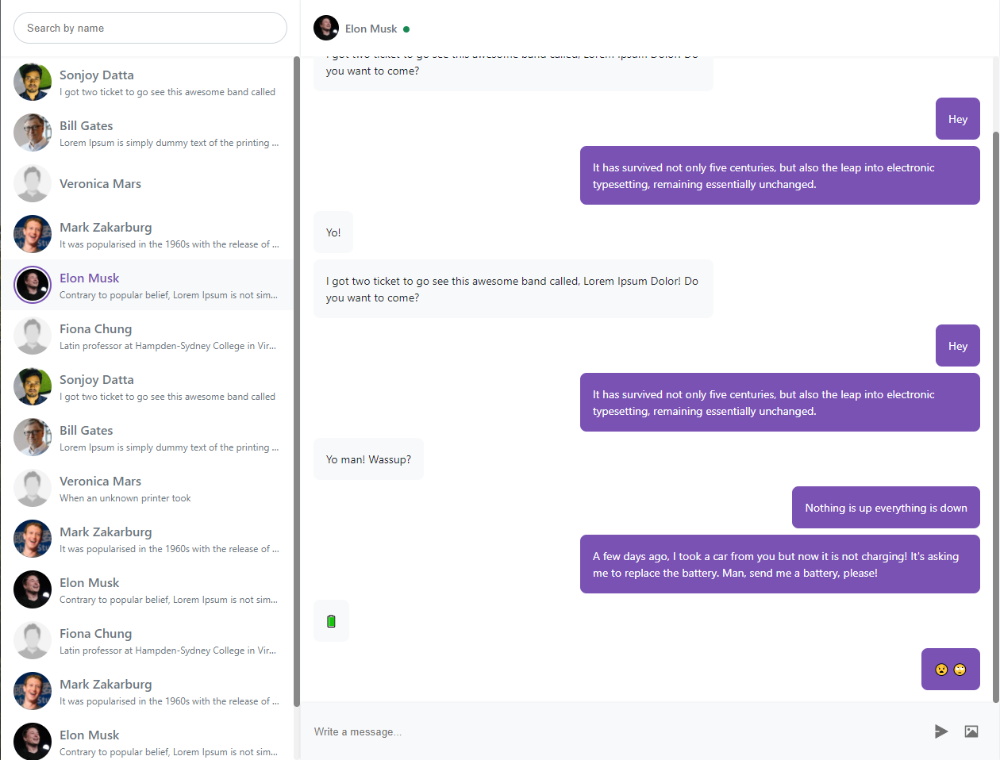

# ReactJs Chat UI

## Requirments

-   NodeJs
-   NPM `or` yarn

## Technology

-   TypeScript
-   ReactJs
-   ESLint
-   Styled Components

## To run distribution

To run, be sure you have [node](http://nodejs.org) installed. Clone the project:

    git clone https://github.com/sonjoydatta/chat_ui.git

Then in the cloned directory, simply run:

    yarn

Running the game:

    yarn run start

And you will have the boilerplate example running on http://localhost:3000

## Demo

Note that you may have to add the file `.env` if you need to use the environment variables. No need to configure anything, I have configured everything for you.

## Author

> All rights Reserved by Sonjoy Datta. [Click here](https://sonjoydatta.me) for more info.

---

Chat UI is licensed under the [MIT License](http://www.opensource.org/licenses/mit-license.php)
